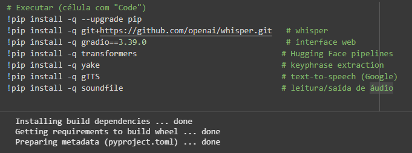
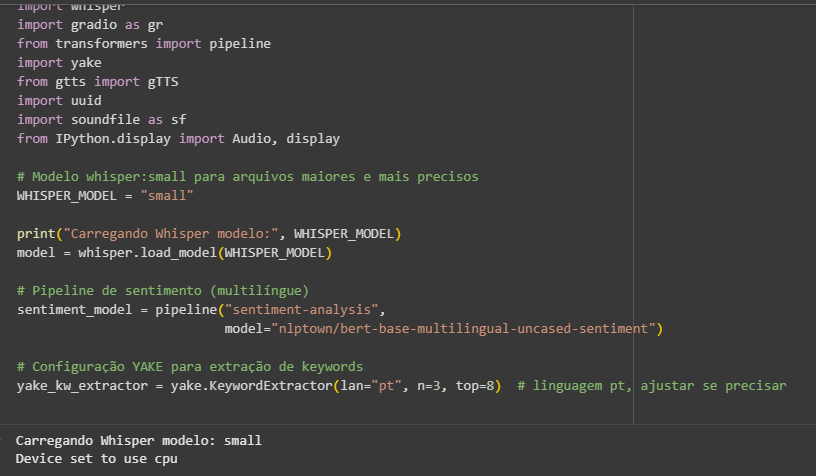
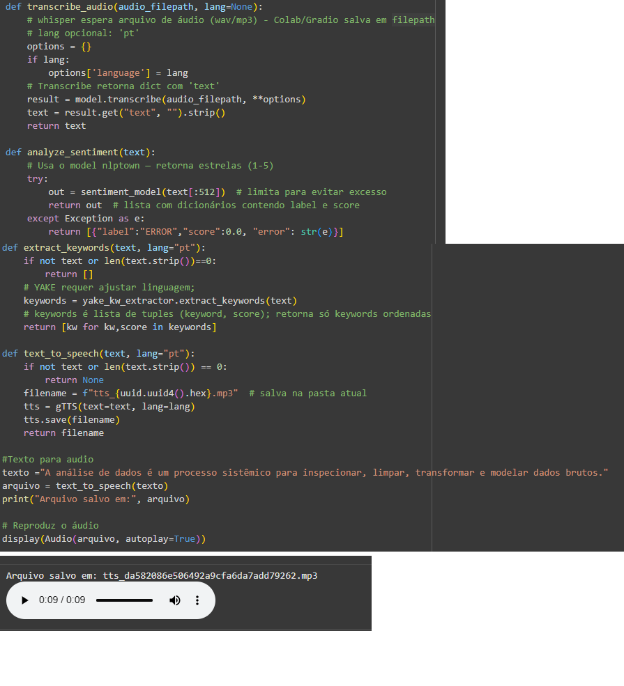
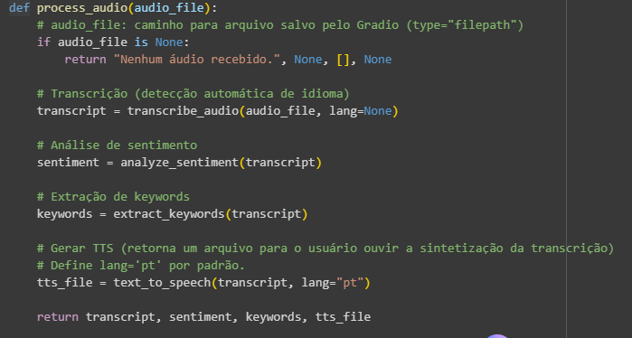
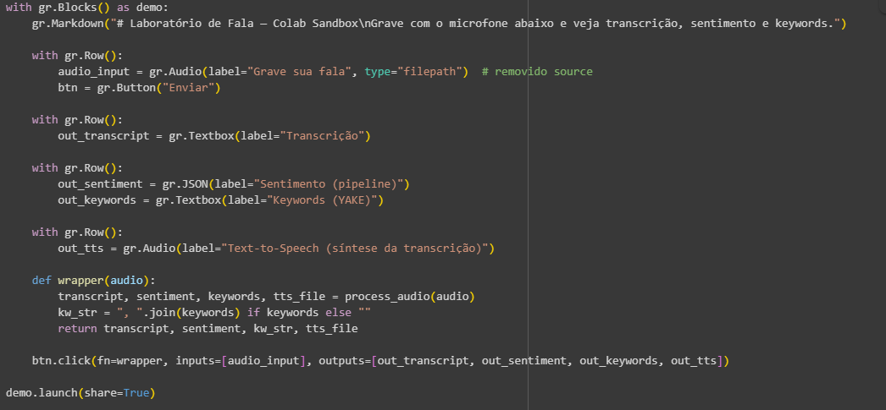
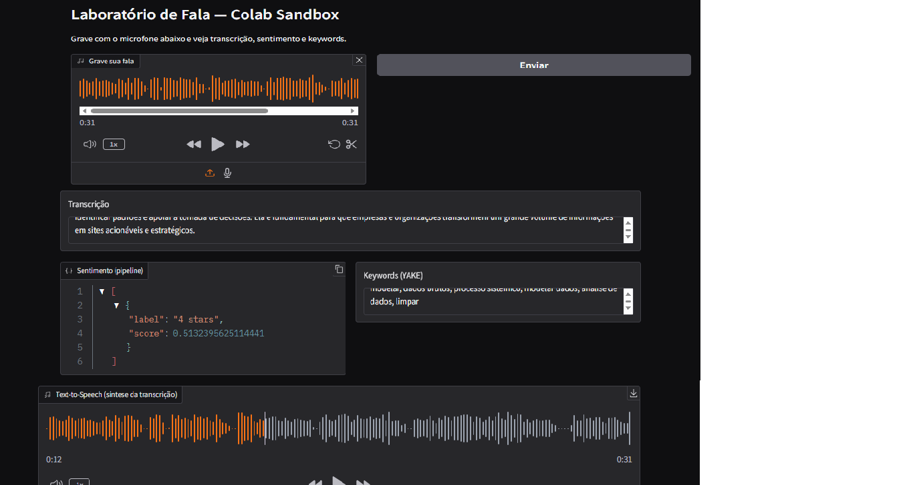

## Laboratório de Fala — Colab Sandbox

Este projeto é um laboratório interativo de fala desenvolvido no Google Colab, que permite ao usuário gravar sua voz, transcrever o áudio, analisar o sentimento do texto e extrair palavras-chave — tudo em uma interface web simples criada com Gradio.

Funcionalidades:

🎧 Gravação de áudio direto pelo microfone.

🗣️ Transcrição automática de fala com o modelo Whisper da OpenAI.

💬 Análise de sentimento multilíngue utilizando o modelo nlptown/bert-base-multilingual-uncased-sentiment.

🏷️ Extração de palavras-chave com o algoritmo YAKE (Yet Another Keyword Extractor).

🔊 Síntese de voz (Text-to-Speech) com gTTS, convertendo o texto transcrito novamente em áudio.

🌐 Interface web interativa construída com Gradio.

🧩 Estrutura do Notebook:

O projeto é dividido em 5 células principais, descritas abaixo:

🧱 Célula 1 — Instalação de Dependências




Instala os pacotes necessários para o funcionamento do projeto:

```bash
!pip install -q --upgrade pip
!pip install -q git+https://github.com/openai/whisper.git     # Whisper (OpenAI)
!pip install -q gradio==3.39.0                                # Interface Web
!pip install -q transformers                                  # Modelos Hugging Face
!pip install -q yake                                          # Extração de keywords
!pip install -q gTTS                                          # Text-to-Speech
!pip install -q soundfile                                     # Manipulação de áudio
```

🧠 Célula 2 — Imports e Carregamento dos Modelos




Carrega as bibliotecas e inicializa os modelos principais:

Whisper (modelo small): utilizado para transcrição de áudio.

Pipeline de sentimento: modelo multilíngue da Hugging Face.

YAKE: configuração para extrair até 8 palavras-chave em português.

⚙️ Célula 3 — Funções Utilitárias




Contém as funções principais do projeto:

transcribe_audio(): realiza a transcrição de um arquivo de áudio. 


analyze_sentiment(): analisa o sentimento do texto transcrito.


extract_keywords(): extrai as principais palavras-chave.


text_to_speech(): converte o texto em áudio com voz sintetizada.


Exemplo de uso:
```python
texto = "A análise de dados é um processo sistêmico para inspecionar, limpar, transformar e modelar dados brutos."
arquivo = text_to_speech(texto)
display(Audio(arquivo, autoplay=True))
```


🔗 Célula 4 — Função Principal




Integra todas as funções anteriores para processar o áudio completo:
```python
def process_audio(audio_file):
    transcript = transcribe_audio(audio_file)
    sentiment = analyze_sentiment(transcript)
    keywords = extract_keywords(transcript)
    tts_file = text_to_speech(transcript, lang="pt")
    return transcript, sentiment, keywords, tts_file
```
🖥️ Célula 5 — Interface com Gradio




Cria a interface web que permite:

Gravar a fala do usuário.

Exibir a transcrição do áudio.

Mostrar o resultado da análise de sentimento.

Listar as palavras-chave detectadas.

Reproduzir o áudio sintetizado.
```python
demo.launch(share=True) : gera um link público temporário.
```
🧰 Tecnologias Utilizadas:

| Biblioteca                | Função Principal               |
|---------------------------|-------------------------------|
| Whisper                   | Transcrição de fala           |
| Gradio                    | Interface interativa          |
| Transformers (Hugging Face)| Análise de sentimento        |
| YAKE                      | Extração de palavras-chave    |
| gTTS                      | Síntese de fala               |
| SoundFile                 | Manipulação de arquivos de áudio |





🧠 Conceitos Envolvidos:

Processamento de Áudio (ASR — Automatic Speech Recognition)

Análise de Sentimento Multilíngue

Extração de Informação (Keywords)

Síntese de Voz (TTS)

Aplicações Interativas de Machine Learning

💡 Como Executar:

Abra o notebook no Google Colab.

Execute todas as células na ordem apresentada.

Aguarde o carregamento do link público gerado pelo Gradio.

Grave sua fala, visualize a transcrição e explore as análises!

📦 Requisitos:

Conta Google (para usar o Colab).

Microfone funcional.

Conexão com a internet.

Python 3.10+ (no ambiente Colab).

🧾 Licença

Este projeto é um protótipo educacional e livre para uso e modificação com fins de aprendizado.

✨ Autoria

[Vânia Cristina Bordin Freitas]

💬 Projeto criado para explorar modelos de linguagem, processamento de áudio e interfaces interativas em Python.
